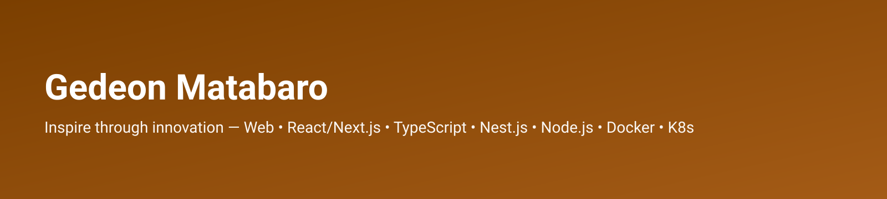

<!-- Profile README for @guidegdm -->

  

<h1 align="center">Hi, I'm Gedeon 👋</h1>

  Inspire through <b>innovation</b> — I build web experiences from landing pages to full products.

  
  
  

---

### 🔭 What I'm building
- **Portfolio** — my work and projects (Next.js + Vercel).
- **Learning tools** — playgrounds & utilities (TypeScript).
- **Globiexplore** — All in one app for travellers with multiple microservices.

### 🧰 Tech I Use
JavaScript / TypeScript • React • Next.js • Node.js • Tailwind CSS • NestJS • gRPC • Redis Stream • Docker • Kubernetes • Kafka

  
  
  
  
  
  
  
  
  
  
  
  

---

### ⭐ Featured projects (update links if private)
| Project | What it is | Repo | Live |
|---|---|---|---|
| Portfolio | Digital CV + projects | `your-repo` | your-live-link |
| Globi experiments | Travel/landing concepts | `your-repo` | — |
| Utilities | TS/Node helpers | `your-repo` | — |

### 📈 Stats (auto-updating)

---

### 🌐 Elsewhere
- Portfolio: https://g.matabaro.com  
- Email: gedeon@matabaro.com

Theme: chocolate (#7B3F00) + white. Keep it clean and readable.
