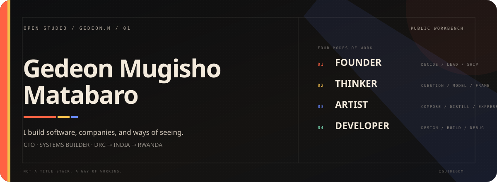
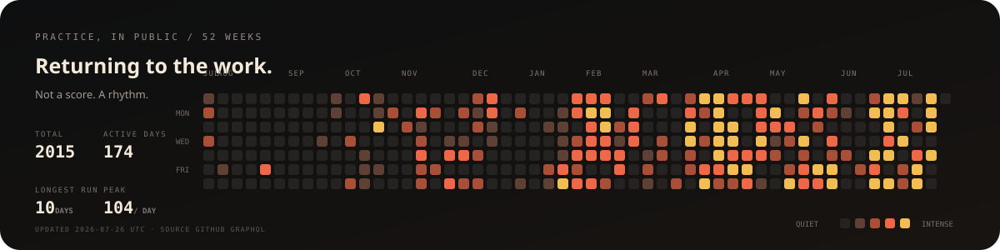

<p align="center">
  
</p>

<p align="center">
  <a href="https://github.com/guidegdm">GitHub</a>&nbsp;&nbsp;·&nbsp;&nbsp;
  <a href="https://x.com/guidegdm">X</a>&nbsp;&nbsp;·&nbsp;&nbsp;
  <a href="https://www.linkedin.com/in/guidegdm">LinkedIn</a>&nbsp;&nbsp;·&nbsp;&nbsp;
  <a href="https://www.instagram.com/guidegdm">Instagram</a>
</p>

<p align="center">
  
</p>

<p align="center"><sub>PRACTICE, IN PUBLIC · generated from GitHub's contribution calendar · refreshed weekly</sub></p>

## I’m Gedeon.

I’m a founder and developer from the Democratic Republic of the Congo. I studied computer science in India, built companies and products in Rwanda and the DRC, and now work as CTO at **[GlobiGuard](https://globiguard.com)**.

I like software that has a point of view. Systems should explain themselves. Interfaces should make complexity feel navigable. Infrastructure should work beyond the places where connectivity, hardware, and institutions behave perfectly.

My work moves between four modes:

|  | Mode | What it means in practice |
|:--|:--|:--|
| `01` | **Founder** | Finding the real constraint, making decisions with incomplete information, and turning an idea into something people can use. |
| `02` | **Thinker** | Questioning the abstraction underneath the feature: authority, memory, time, evidence, failure, and trust. |
| `03` | **Artist** | Giving systems rhythm, hierarchy, language, and an interface that makes their character visible. |
| `04` | **Developer** | Moving across product, backend, data, infrastructure, and AI until the whole thing works. |

## What I’m good at

### Systems that think and act

AI agents, tool use, controlled actions, context and memory, evaluation, human review, and the boundaries between probabilistic models and deterministic software.

### Products that survive reality

Offline-first applications, synchronization, operational workflows, role-based systems, audit history, and software designed for unreliable infrastructure.

### Backends with consequences

Distributed services, APIs, event-driven workflows, authentication, authorization, databases, queues, caching, observability, containers, and cloud delivery.

### Turning architecture into product

I can move from a technical thesis to a working interface, explain the tradeoffs plainly, and keep the implementation connected to the user’s actual problem.

## Working vocabulary

```text
TYPE        TypeScript · Python · Go · Rust · SQL · Dart
SYSTEMS     distributed backends · databases · offline sync · cloud infrastructure
AI          agents · tool use · memory · evaluation · governance
PRODUCT     interaction design · workflow design · rapid prototyping · shipping
OPERATING   founder decisions · technical leadership · cross-border execution
```

## Public proof

A few public surfaces show parts of the work:

- **[GlobiGuard open source](https://github.com/globiguard)** — SDKs and integration surfaces for governed AI workflows.
- **[FieldFlow](https://github.com/guidegdm/fieldflow)** — an offline-first operational workflow platform, with a [public demo](https://fieldflow-tau.vercel.app).
- **[GlobiGuard visual explainer](https://github.com/guidegdm/demo-globiguard)** — an interactive explanation of an AI-governance system.

## Things I believe

> A model can suggest. A system still has to decide.

> Offline is not an edge case when the product is built for the real world.

> Good engineering reduces the number of things a user must blindly trust.

> A difficult system deserves an interface with clarity, not more decoration.

## Coordinates

DRC → India → Rwanda → wherever the work needs to happen next.

<p align="center">
  <a href="https://x.com/guidegdm">@guidegdm</a>&nbsp;&nbsp;·&nbsp;&nbsp;
  <a href="https://www.linkedin.com/in/guidegdm">Let’s connect</a>
</p>

<p align="center"><sub>Hand-built as a personal artifact—not a résumé template.</sub></p>
