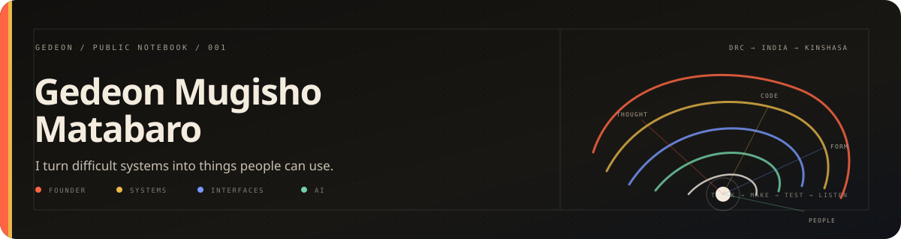

  

  <a href="#work-you-can-open">Work</a>&nbsp;&nbsp;·&nbsp;&nbsp;
  <a href="https://x.com/guidegdm">Notes</a>&nbsp;&nbsp;·&nbsp;&nbsp;
  <a href="https://www.linkedin.com/in/guidegdm">Experience</a>&nbsp;&nbsp;·&nbsp;&nbsp;
  <a href="https://globiguard.com">GlobiGuard</a>

## Hello — I'm Gedeon.

I build at the point where **software, people, and difficult constraints** meet. I grew up in the Democratic Republic of the Congo, studied computer science in India, and now build from Kinshasa.

Today I am CTO at **[GlobiGuard](https://globiguard.com)**. I work across architecture, model training, product, and the open-source libraries and SDKs that let developers use what we build.

But a job title is only one frame. My real practice is learning how a complicated idea becomes a clear system—and how that system becomes useful to someone else.

<table>
  <tr>
    <td width="50%" valign="top">
      <h3>01 / I frame</h3>
      Before I reach for a framework, I look for the hidden question: where does state live, who has authority, what happens after failure, and what must remain explainable?
    </td>
    <td width="50%" valign="top">
      <h3>02 / I engineer</h3>
      I move from interface to API, model, database, queue, and deployment. The boundaries between layers are often where the real product lives.
    </td>
  </tr>
  <tr>
    <td width="50%" valign="top">
      <h3>03 / I shape</h3>
      I care about language, rhythm, hierarchy, and interaction. Design is how a system reveals its character—not decoration applied after it works.
    </td>
    <td width="50%" valign="top">
      <h3>04 / I lead</h3>
      I turn incomplete information into a direction, make the technical tradeoffs visible, and stay close enough to the code to keep decisions honest.
    </td>
  </tr>
</table>

## Range, with a point of view

| Layer | What I work on | What I care about |
|:--|:--|:--|
| **Intelligence** | Model training, agents, tool use, evaluation, human review | Useful autonomy with clear boundaries |
| **Systems** | Distributed services, APIs, databases, queues, caching, synchronization | State, failure, evidence, and recovery |
| **Product** | Web and mobile products, workflow design, interaction systems | Making complexity feel navigable |
| **Infrastructure** | Containers, cloud delivery, CI/CD, observability | Software that survives outside the demo |
| **Operating** | Technical strategy, company building, cross-border execution | Finding the real constraint and moving through it |

<strong>The working set</strong> — languages and tools I reach for

 

**Languages** · TypeScript, Python, Go, Rust, SQL, JavaScript, Dart 
**Application** · React, Next.js, Node.js, NestJS, Flutter, REST, gRPC 
**Data & events** · PostgreSQL, Redis, Redis Streams, event-driven systems, offline synchronization 
**Delivery** · Docker, Kubernetes, cloud infrastructure, CI/CD, observability

## A practice, not a stack

I started by building web and mobile products: a learning platform, realtime applications, commerce systems, and a ride-sharing prototype. Backend work pulled me deeper into service boundaries, gRPC, streams, data, and deployment. AI work brought a new set of questions about models that act, evidence, evaluation, and human judgment.

The technologies changed. The instinct stayed the same: **follow the problem through every layer instead of stopping where one discipline ends.**

### Three notes I keep returning to

> A model can propose an action. A system still has to take responsibility for it.

> Offline is not an edge case when you build for the real world.

> The best interface is not the one with the least complexity. It is the one that makes the right complexity understandable.

## Work you can open

<table>
  <tr>
    <td width="50%" valign="top">
      <strong><a href="https://github.com/globiguard">Open-source SDKs ↗</a></strong>  
      Developer libraries across ecosystems for bringing governed AI workflows into existing software.
    </td>
    <td width="50%" valign="top">
      <strong><a href="https://github.com/guidegdm/fieldflow">FieldFlow ↗</a></strong>  
      An offline-first workflow platform designed for field teams working with unreliable connectivity. <a href="https://fieldflow-tau.vercel.app">Live demo</a>.
    </td>
  </tr>
  <tr>
    <td colspan="2" valign="top">
      <strong><a href="https://demo-globiguard.vercel.app">Interactive explainer ↗</a></strong>  
      A visual product story for making an unfamiliar technical system understandable without flattening the idea.
    </td>
  </tr>
</table>

These are evidence, not the whole identity. GitHub's native contribution graph on this profile shows the day-to-day work without a duplicate or imitation.

## Before the code

In university, I wanted to bring international students from different campuses in Odisha together, but inter-university events were not allowed. I created an independent student association outside any one campus. When the university saw the community could organize elsewhere, it offered to host and support the event instead.

That experience still shapes how I build: a constraint is real, but the first shape it presents is rarely the only way through.

`DRC` → `India` → **Kinshasa**

---

  <strong>I'm always interested in people building where technology meets the untidy real world.</strong>  
  <a href="https://github.com/guidegdm">GitHub</a>&nbsp;&nbsp;·&nbsp;&nbsp;
  <a href="https://x.com/guidegdm">X</a>&nbsp;&nbsp;·&nbsp;&nbsp;
  <a href="https://www.linkedin.com/in/guidegdm">LinkedIn</a>&nbsp;&nbsp;·&nbsp;&nbsp;
  <a href="https://www.instagram.com/guidegdm">Instagram</a>

Built by hand. Kept human.

